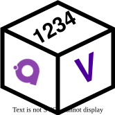
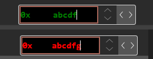
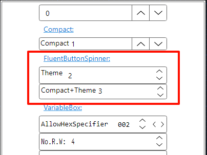

# VariableBox

<p align="center">

Want to help

> 欢迎任何人士帮忙支持并让这个简单控件变得更好，我们需要你们。

> welcome any one to help and make this simple control better, we need you.

</p>

[](https://github.com/heartacker/VariableBox.Avalonia)
[](https://github.com/heartacker/VariableBox.Avalonia/releases)
[](https://www.nuget.org/packages/VariableBox.Avalonia)


<p align="center">
    
</p>

<p align="center">


</p>

VariableBox is an Avalonia Control for building cross-platform UIs with Avalonia UI.

| Theme | Fluent                                                                                      | Semi                                                                                      |
| ----- | ------------------------------------------------------------------------------------------- | ----------------------------------------------------------------------------------------- |
| Dark  |   |   |
| Light |  |  |

## ChangeLog
- 2025/03/10(0.8.0)
  - unify the semi NumericalBox and VariableBox
  - Use MonoSpace etc. font by default
  - Update readme for event and command
  - Update demo for event and command

- 2025/02/25(0.7.0)
  - Mass UI Polish
  - Uniform the UI for each App Theme
  - An new Spinner Theme for FluentTheme
    - you can change the `NumericUpDown` Theme just like `VariableBox`

- 2025/02/21(v0.6.0)
  1. unify the `tab` key focus behavior, only the text box and read write button can be focused
  2. fix the enter key trigger behavior bug
  3. style polish, uniform the style of the button spinner and the disabled style
  4. demo update

- 2025/02/20(v0.5.0)
  1. remote property `IsEnableEditingIndicator` indicator
  2. please use the  `PseudoClasses`
     1. `:editing` for editing
     2. `:invalid` for invalid input

- 2025/02/19(v0.4.0)
  1. fix the style of buttonspinner and the disabled style
     1. fluent,semi and simple is all supported

- 2025/1/21(v0.3.0)
  1. Add an overall border to create a more unified visual effect.
  2. other polish

- 2025/1/9 (v0.2.1)
  1. Using a theme pack that is compatible with `Simple`, `Fluent`, and `SemiThemes`.
  2. Package Theme To the Control Package, You do not need another package anymore

## Feature

### NumericalUpDown

- all numerical type support
- spinning updown support
- get (read) /set (write) support
- rich formatting support like `hex`, `dec` and `bin`
- drag support, you can use mouse to drag
- mouse scroll support
- shortcut and arrow key support
  - <kbd>Esc</kbd> for cancel editing
  - <kbd>Enter</kbd> for trigger
  - <kbd>up</kbd> for increase
  - <kbd>down</kbd> for decrease
  - <kbd>alt+left</kbd> for read
  - <kbd>alt+right</kbd>/<kbd>alt+enter</kbd>for trigger (force) write
- identify support
  - `*` for editing
  - **red** <font color=red>*</font> for error input
  - **green** <font color=green>*</font> for right input

### EnumerationUpDown

- [ ] compact mode
- [ ] boarder

## How to use

### VariableBox

Add nuget package:

```bash
dotnet add package VariableBox.Avalonia
```

You can now use VariableBox controls in your Avalonia Application.

```xml
<Window
    ...
    xmlns:vbox="VariableBox"
    ...>
    <StackPanel Margin="20">
        <vbox:VariableBoxUInt Value="{Binding Value}"
            FormatString="X8"
            HeaderContent="0x"
            ParsingNumberStyle="AllowHexSpecifier"
            Step="2"
            IsEnableEditingIndicator="True"
            />
    </StackPanel>
</Window>
```

### CommandS and Events

FYI, you can see demo.

#### Event

we have Read and Write(ValueChenged)Event.

- **ValueChanged** or you click write, you can get the old and new value

  `public event EventHandler<ValueChangedEventArgs<T>>? ValueChanged`

- **ReadRequestedEvent** When you Click Read,
  >**you can update your value while reading and there is not valueChangeEvent**

  `public event RoutedEvent<RoutedEventArgs> ReadRequestedEvent`

- **HeaderDoubleTapedEvent** When you Double the header

  `public static readonly RoutedEvent<TappedEventArgs> HeaderDoubleTapedEvent`

#### Command for MVVM

- `Commnad` Value changed or click the write
   >**Please don't set the CommandParater to Current Value, Like `CommandParameter="{Binding Value}"` will get you the old value**

   1. you can just binding with a command like `WriteCommnad(uint v)`, **you don't need to set the Command parater by default**
   2. we will send the updated-value for you

- `ReadCommand` When you click Read

   same as `Commnad`, The default parameter will be the **current value**

- `HeaderDoubleTapedCommand` when you double click the Header

#### Demo

```csharp
//view
Command="{Binding TrythisCommand}"
ReadCommand="{Binding ReadDemoCommand}"

// viewmodel
[RelayCommand]
void Trythis(uint v)
{
    CommandUpdateText =
    $"Binding without CommandParater, and the default parameter will be the new value={v}";
}

// viewmodel
[RelayCommand]
void Trythis()
{
    // also work too
}

// viewmodel
[RelayCommand]
void ReadDemo(uint v)
{
    CommandUpdateText =
    $"Binding without CommandParater,
    and the default parameter will be the current value={v}";
}

// viewmodel
[RelayCommand]
void ReadDemo()
{
    // also work too
}

```

#### Note for command

- `CommandParameter="{Binding Value}"` will get you the old value

### PseudoClasses

> VariableBox is based  vbox:NumericUpDown

- `:editing` for editing
- `:invalid` for invalid input

e.g.:

<div style="display: flex;">
  <div style="flex: 50%; padding: 2px;">


```xml
<Style Selector="vbox|NumericUpDown:editing">
  <Style Selector="^ /template/ TextBox#PART_TextBox">
      <Setter Property="Foreground" Value="Green" />
  </Style>
  <Style Selector="^:invalid /template/ TextBox#PART_TextBox">
      <Setter Property="Foreground" Value="Red" />
  </Style>
</Style>
```

  </div>

  <div style="flex: 20%; padding: 2px;">



  </div>
</div>


### VariableBox.Themes

To make VariableBox controls show up in your application, you need to reference to a theme package designed for VariableBox.

**YOU do not need any other VariableBox package now**

- `vbox:FluentTheme` is compatible with `<FluentTheme/>`
- `vbox:SemiTheme` is a theme package for VariableBox inspired by Semi Design.

  > you need to `add package Semi.Avalonia` first
  >
- `vbox:SimpleTheme` is compatible with `<SimpleTheme/>`

You can add it to your project by following steps.

1. Add nuget package:

```bash
dotnet add package VariableBox.Avalonia
```

2. Include Styles in application:

- FluentTheme

```xml
<Application...
    xmlns:vbox="VariableBox"
    ....>
    <Application.Styles>
        <!-- set this theme -->
        <vbox:FluentTheme Locale="zh-CN"/>
    </Application.Styles>
```

- SimpleTheme

```xml
<Application...
    xmlns:vbox="VariableBox"
    ....>
    <Application.Styles>
        <SimpleTheme/>
        <vbox:SimpleTheme Locale="zh-CN"/>
    </Application.Styles>
```

- SemiTheme

```bash
dotnet add package Semi.Avalonia
```

```xml
<Application...
    xmlns:vbox="VariableBox"
    ....>
    <Application.Styles>
        <!-- if use semi -->
        <semi:SemiTheme Locale="zh-CN"/>
        <vbox:SemiTheme Locale="zh-CN"/>
    </Application.Styles>
```

#### Additional Theme for Fluent ButtonSpinner

for `FluentTheme` user, you can changed the `ButtonSpinner` just like `VariableBox`



for example:

1. `ButtonSpinner`

```xml
<ButtonSpinner Content="10" Theme="{DynamicResource FluentButtonSpinner}" />
```

2. Sys `NumericUpDown`

```xml
<NumericUpDown InnerLeftContent="Theme" Value="2">
  <NumericUpDown.Styles>
    <Style Selector=":is(ButtonSpinner)">
        <Setter Property="Theme" Value="{DynamicResource FluentButtonSpinner}" />
    </Style>
  </NumericUpDown.Styles>
</NumericUpDown>

```

```xml
<Style Selector="NumericUpDown /template/ :is(ButtonSpinner)">
    <Setter Property="Theme" Value="{DynamicResource FluentButtonSpinner}" />
</Style>
```
